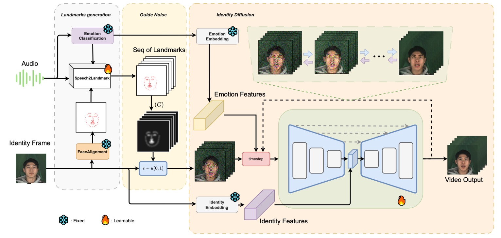
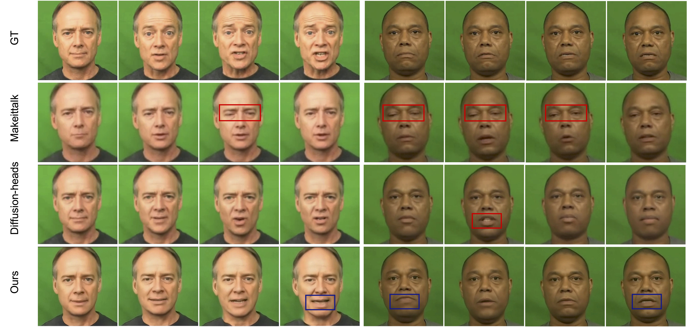

# ATL-Diff: Audio-Driven Talking Head Generation  using Early Landmark Guide Noise Diffusion.
---
*Abtract: Audio-driven talking head generation presents significant challenges in creating realistic facial animations that accurately synchronize with audio signals. This paper introduces ATL-Diff, a novel approach that addresses key limitations in existing methods through an innovative three-component framework. The Landmark Generation Module supports to construction a sequence of landmarks from audio. Landmarks Guide Noise is the approach adds movement information by distributing the noise following landmarks so it isolates audio from the model. 3D Identity Diffusion network to preserve keep the identity characteristics. Experimental validation on the MEAD and CREMA-D datasets demonstrates the method’s superior performance. ATL-Diff significantly outperforms state-of-the-art techniques across all critical metrics. The approach achieves near real-time processing capabilities, generating high-quality facial animations with exceptional computational efficiency and remarkable preservation of individual facial nuances. By bridging audio signals and facial movements with unprecedented precision, this research advances talking head generation technologies with promising applications in virtual assistants, education, medical communication, and emerging digital platforms.*

---
## Model Architecture


## Qualitative Results

---
## How to train:
Update soon!

---
## How to inference:
#### Get the repository:
- Clone the repository:
    ```bash
    git clone https://github.com/sonvth/ATL-Diff
    cd ATL-Diff
    ```

#### Setup enviroment:
- Run this source on terminal 
    ```bash
    python3 -m venv .venv
    pip3 install -r requirements.txt
    ```

#### Inference

- Download weights in from this: https://drive.google.com/drive/folders/1_6UB-2hD4XVMzZhauBT7YGG2t9FGgFho?usp=drive_link
- Put downloaded folder into repo.
- Edit audio source and identity source in [config.py](config.py) file.

- Run this command:
    ```bash
    run infer.sh
    ```
---


***Please star and follow if this repository helpful for you***

**Authorized by sowwn**
---

